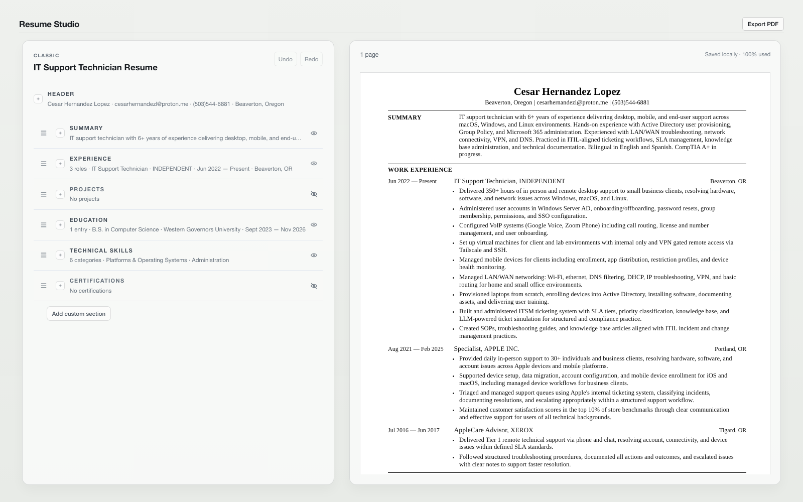

# Resume Studio

**Resume Studio v1.0.0 — Production**

Resume Studio is a focused, self-hosted resume-authoring workstation for tailoring structured resume content, organizing document structure, reviewing a live preview, and exporting reliable PDF resumes.

The resume document is the primary artifact. Resume Studio keeps content structured and presentation controlled so that editing remains predictable and exported documents remain consistent.



## Design philosophy

Resume Studio is document-first software:

- content is edited through known resume sections rather than a freeform page canvas;
- section order, entries, and bullets remain explicit and controllable;
- templates control typography, spacing, hierarchy, and print presentation;
- local ownership and self-hosting are preferred over account-based services;
- the interface stays restrained so the document remains the focus.

External writing tools can be used separately. Resume Studio itself is the structured document-authoring surface.

## Current capabilities

### Structured content

The editor currently supports:

- Header and contact information
- Summary
- Experience
- Projects
- Technical Skills
- Education
- Custom Sections

### Structural editing

The current editor supports:

- reordering sections;
- reordering Experience, Project, and Education entries;
- reordering Experience and Project bullets;
- including or excluding sections without deleting their stored content;
- adding, editing, and removing supported structured content.

### Undo and Redo

Undo and Redo are scoped to the active resume document and kept in memory. History is intentionally not restored after a browser reload.

### Preview and page awareness

The live preview updates from the canonical resume document. The preview reports page count and provides one-page usage feedback where appropriate. It is a continuous document surface rather than a physical stack of page sheets.

### PDF export

PDF export uses the same template/rendering path as the browser preview. The current Classic presentation produces conservative, text-based, single-column output intended to remain readable and ATS-friendly. Resume Studio does not provide ATS scoring or guarantee acceptance by any particular ATS.

### Templates

The current release includes one template: **Classic**. Template support is intentionally controlled; there is no template marketplace or freeform layout editor.

## Architecture overview

- `ResumeDocument` v4 is the canonical resume model.
- Header is fixed outside the ordered `sections` collection.
- Sections are typed structured content, with the array order defining below-header presentation order.
- A versioned `ResumeLibrary` is persisted in browser `localStorage`.
- Undo and Redo use resume-scoped, in-memory document history.
- Browser preview and server PDF export resolve the same template registry and rendering components.
- Server-side PDF generation uses Playwright.

## Local development

### Prerequisites

Use a current Node.js installation with npm. The repository includes a lockfile for repeatable dependency installation.

### Install and run

```bash
npm ci
npm run dev
```

Open [http://localhost:3000](http://localhost:3000).

Normal local development does not require application environment variables.

### Validation commands

```bash
npm test
npx tsc --noEmit --incremental false
npm run lint
npm run build
node --experimental-strip-types scripts/validate-pagination.ts
```

The pagination validation script checks browser page awareness against exported PDF page counts for representative fixtures.

## Deployment overview

The repository includes a container-based deployment path:

- [Dockerfile](Dockerfile) builds the application image with its Playwright runtime;
- [deploy/docker-compose.yaml](deploy/docker-compose.yaml) runs the production container;
- [cicd.app.yaml](cicd.app.yaml) defines the image, deployment, and health-check contract;
- [GitHub Actions workflow](.github/workflows/build-deploy.yaml) builds and publishes the image to GHCR, then runs the deployment and verification workflow;
- production routing uses Traefik;
- the application health endpoint is `/api/health`.

Operational deployment details belong in the deployment configuration and workflow files rather than in this README.

## Known limitations

- Resume data is persisted in the browser locally; there is no database, server-backed resume storage, or account synchronization.
- Undo and Redo history does not survive a browser reload.
- Classic is currently the only available template.
- Certifications can be represented and rendered, but do not yet have a complete editor workflow.
- The preview reports page awareness but does not yet display physical page-sheet surfaces.
- The application is designed primarily for one local or self-hosted user, not collaborative multi-user operation.

## Future direction

Future development is workflow-driven and will be guided by needs discovered through real resume tailoring and use. The v1 application remains focused on structured editing, reliable preview, and PDF export.
